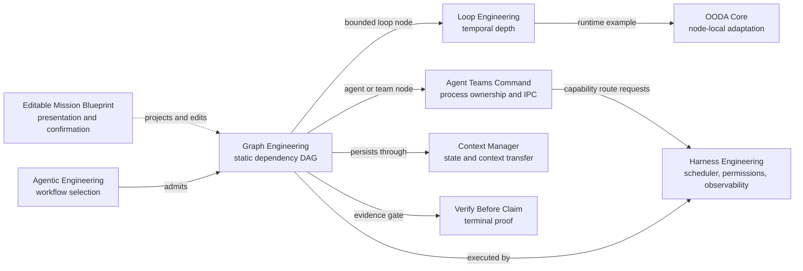

# Graph Engineering Architectures

A standalone architecture bundle extracted from
[Third Brain V7 Skills](https://github.com/Mark393295827/third-brain-v7-skills).
It focuses on bounded static dependency graphs and the adjacent contracts
required to run them without blurring ownership.

Graph Engineering owns dependency width: typed edges, explicit joins,
deterministic readiness, single-writer constraints, durable graph state, and
node-local recovery. It does not own temporal repetition, worker processes, or
the runtime kernel.

## Open the Editable Mission Blueprint

Open [`index.html`](index.html) to see the complete mission before starting
work. The page is a local-first editor for mission intent, the strict static
DAG, Agent Team allocation, and presentation format.

For the most consistent browser behavior:

```powershell
python -m http.server 8080
```

Then open `http://localhost:8080/`. The default **Blocks** workspace offers
starter recipes and safe Lego-like blocks over the canonical DAG; **Advanced**
opens the complete node, edge, join, workstream, and JSON controls without
creating a second format. Resolve validation issues and issue a human
confirmation receipt. Only then does the page unlock the capability-based
Agent Team command and handoff export. The exported pack
remains pending strict validation of its embedded Graph and command contracts,
then a separate Harness adapter-readiness gate. The browser never starts
agents, probes adapters, or claims that work has executed.

The canonical seed is
[`blueprint/default-blueprint.json`](blueprint/default-blueprint.json), and the
full workflow and safety boundary are documented in
[`docs/mission-blueprint.md`](docs/mission-blueprint.md).

New operators should start with the
[`complete project usage manual`](docs/project-usage-manual.md). After the
basic workflow is familiar, use the
[`maximum-potential operating guide`](docs/maximum-potential-guide.md) to tune
architecture admission, capability routing, concurrency, evidence, recovery,
and review capacity.

## Architecture Map



The machine-readable source of truth is
[`architecture-manifest.json`](architecture-manifest.json).

## Dynamic Multimedia Foundation

Phase 1 adds the versioned contract registry in
[`blueprint/contracts`](blueprint/contracts). The task-template catalog in
[`blueprint/task-template-registry.json`](blueprint/task-template-registry.json)
compiles each approved task into one finite static Graph. The adapter registry
in [`blueprint/adapter-registry.json`](blueprint/adapter-registry.json) declares
Claude Code, Codex, Antigravity, Grok, Kimi, and DeepSeek as optional,
probe-gated runtime candidates. No provider is considered ready until a later
Harness probe produces a receipt, and no media bytes or credentials enter a
blueprint or IPC message.

Read the [Phase 1 dynamic multimedia blueprint](docs/dynamic-multimedia-blueprint.md)
for the contract boundary and migration order. Validate the declarations with:

```powershell
python tools/validate_dynamic_contracts.py --strict
```

The web blueprint is a supporting projection, not an architecture. Visual
placement is not dependency topology, and animation is not execution.

### Graph admission preflight

The Mission view also exposes a deterministic admission card. It turns the
dependency-width lessons in the linked research post into editable, local
evidence: select the dependency source, partition strategy, coupling profile,
structural hubs, critical-path floor, fan-out, request-rate, and coordination
tax budgets before allocating agents. The browser preview never schedules a
worker. For command evidence against a real contract, run:

```powershell
python tools/graph_admission_gate.py blueprint/default-blueprint.json --strict
```

The gate isolates hubs, measures the critical-path floor, caps effective
fan-out against Graph concurrency, and fails closed on missing dependency
evidence, rate-limit excess, or disabled zero-token preflight. The external
benchmark numbers are research context, not local performance claims; the
receipt is derived from the declared Graph.

## Included Architectures

| Layer | Owns | Path |
|---|---|---|
| Graph Engineering | Static DAG topology, typed edges and joins, node-local recovery | `skills/graph-engineering/` |
| Loop Engineering | Bounded repetition through time inside a node | `skills/loop-engineering/` |
| Agentic Engineering | Workflow autonomy and architecture selection | `skills/agentic-engineering/` |
| Agent Teams Command | Process ownership, IPC, isolation, integration, cleanup | `skills/agent-teams-command/` |
| Harness Engineering | Scheduler, permissions, leases, tools, observability | `skills/harness-engineering/` |
| Context Manager | Durable context, checkpointing, edge-payload discipline | `skills/context-manager/` |
| Verify Before Claim | Node, join, and terminal evidence gates | `skills/verify-before-claim/` |
| OODA Core | A bounded node-local decision-loop implementation | `core/ooda/` |

The bundle also includes the strict Graph and Loop validators, unit tests,
static fixtures, benchmark code, and historical experiment receipts.

## Opening Mission Blueprint

Open the root `index.html` to see the complete mission immediately in the
source-aligned 1536×1024 structural diagram. Every major visual panel opens its
canonical mission, Graph, Agent Team, or presentation editor.

Claude, Antigravity, and Codex appear in the legacy editable runtime adapter
declarations used by the static editor. The Phase 1 registry additionally
declares Grok, Kimi, and DeepSeek for the future dynamic runtime. All six are
optional, probe-gated candidates; durable Graph and workstream ownership
remains capability-based. The browser never selects an adapter, stores
credentials, probes endpoints, launches agents, or claims a readiness receipt.

## Quick Start

Validate the strict diamond contract:

```powershell
python skills/graph-engineering/scripts/validate_graph_contract.py `
  skills/graph-engineering/references/diamond-graph-example.json --strict
```

Run all Python checks:

```powershell
python -m unittest discover -s tools -p "test_*.py" -v
python -m unittest discover -s experiments/graph-engineering/tests -p "test_*.py" -v
```

Run the bounded Loop-vs-Graph experiment:

```powershell
python experiments/graph-engineering/benchmark.py
```

Run the OODA implementation check:

```powershell
node core/ooda/ooda_loop.test.js
```

## Admission Rule

Use Graph Engineering only when at least one measurable benefit exceeds
scheduler and review overhead:

1. Independent branches shorten the critical path.
2. Maker and checker require separate ownership or context.
3. Node-local recovery avoids replaying verified work.
4. Typed joins materially improve failure localization.

Otherwise, keep the workflow one-shot or use Loop Engineering. V7.1 supports
bounded static DAGs only. Dynamic expansion and cyclic graphs are explicitly
out of scope.

## Documentation

- [`docs/project-usage-manual.md`](docs/project-usage-manual.md) is the
  complete beginner-to-runtime manual for the web interface, contracts,
  validators, tests, recovery, and extension workflows.
- [`docs/maximum-potential-guide.md`](docs/maximum-potential-guide.md) is the
  operating playbook for maximizing verified throughput with bounded Graph,
  Loop, Agent Team, and Harness controls.
- [`docs/architecture-boundaries.md`](docs/architecture-boundaries.md) defines
  the MECE ownership model and routing rules.
- [`docs/adoption-guide.md`](docs/adoption-guide.md) provides a staged rollout.
- [`docs/extraction-inventory.md`](docs/extraction-inventory.md) records what
  was copied and what was intentionally excluded.
- [`docs/upstream-provenance.md`](docs/upstream-provenance.md) records source,
  commit, licensing, and update policy.
- [`docs/blueprint-web-provenance.md`](docs/blueprint-web-provenance.md)
  records the user-supplied visual source, hashes, asset status, and adaptation
  boundary.

## Provenance

This repository was extracted from upstream commit
`9cf925c16510c6efe9bf44968fbfa27340a3337b` on 2026-07-27. Copied assets retain
their upstream paths so examples and tests remain directly traceable.
The separately supplied blueprint raster assets have their own checksum and
rights record; they are not represented as Third Brain MIT assets.

## License

MIT. See [`LICENSE`](LICENSE).
